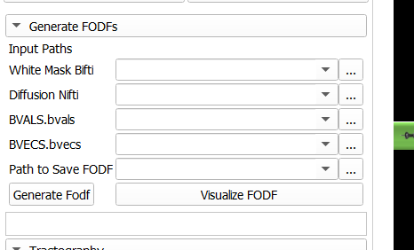

# Slicer Extension: White Matter Analysis Toolkit

The **White Matter Analysis Toolkit** is a 3D Slicer extension that provides a unified interface for white matter analysis using diffusion MRI data. It integrates three core submodules: **Generate FODF**, **Tractography**, and **Metric Analysis**, all accessible through a single module interface.

---

## Features

### 1. **Generate FODF Submodule**
Generates Fiber Orientation Distribution Functions (FODFs) using diffusion MRI data.  

**Inputs:**
- **White Mask**: Binary mask for white matter regions.
- **Diffusion NIfTI**: Diffusion-weighted image file.
- **BVALS**: File containing b-values (`.bvals`).
- **BVECS**: File containing b-vectors (`.bvecs`).

---

### 2. **Tractography Submodule**
Generates white matter fiber tracts based on the provided FODF and seeding masks, with options to visualize the tracts in 3D.  

**Inputs:**
- **Approximate Mask**: Binary mask approximating regions of interest for tractography.
- **FODF**: Fiber Orientation Distribution Function file generated from the **Generate FODF** submodule.
- **Step Size**: Step size for tractography.
- **Algorithm**: Choice of tractography algorithm (`deterministic` or `probabilistic`).

**Outputs:**
- **.trk file**: White matter fiber tracts.
- **.vtk file**: Visualization-ready fiber tracks for Slicer.

**Features:**
- Generates a seeding mask from the approximate mask.
- Converts `.trk` files to `.vtk` for visualization in Slicer.

---

### 3. **Metric Analysis Submodule**
Calculates metrics to compare two tractography files, enabling evaluation of overlap and spatial agreement.

**Metrics:**
- **Dice Score**: Quantifies spatial agreement between tracks.
- **Overreach Score**: Tracks extending beyond the target area.
- **Overlap Score**: Shared region between two tractographies.

---

## Installation

1. Clone this repository:
   ```bash
   git clone https://github.com/anoushkrit/SlicerTracto.git
   ```

2. Switch to extension-with-integrated-modules and then Clone the **scilpy** library inside the main module directory:
   ```bash
   cd DMRI_TRACTOGRAPHY
   git clone https://github.com/scilus/scilpy.git DMRI_Tractography/scilpy
   ```

   The `scilpy` library provides essential tools for diffusion MRI processing and tractography.

3. Open **3D Slicer** and navigate to the **Extensions Manager**.

4. Install the extension manually by adding the repository directory to Slicer's module paths:
   - Go to `Edit > Application Settings > Modules > Additional Module Paths`.
   - Add the path to the downloaded repository.

5. Restart Slicer to load the extension.

---

## Usage

1. **Launch the Extension**  
   Open the **White Matter Analysis Toolkit** module in Slicer.

2. **Select a Submodule**  
   Choose one of the three submodules:  
   - **Generate FODF**: Provide the white mask, diffusion NIfTI, `.bvals`, and `.bvecs`.
   - **Tractography**: Provide the approximate mask, FODF, step size, and algorithm.
   - **Metric Analysis**: Provide two `.trk` files for comparison.

3. **Run the Analysis**  
   Execute the selected submodule and view results directly in Slicer, including 3D visualizations of tracks.

---

## Screenshots

### Main Module Interface


### Generate FODF Submodule


### Tractography Submodule


### Metric Analysis Submodule


---

## Dependencies

This extension requires the following:
- **3D Slicer (Version ≥ 5.0)**  
- `numpy`  
- `scipy`  
- `dipy`  
- `vtk`  

---

## Contributing

Contributions are welcome! Submit issues or feature requests via [GitHub Issues](https://github.com/anoushkrit/SlicerTracto/issues).

---

## License

This project is licensed under the MIT License. See the [LICENSE](LICENSE) file for details.

---

## Authors

- **Contributors:**  
  - Gagan Gupta (IIT MANDI)  
  - Mahir Jain (IIT MANDI)
  - Ankita Joshi (IIT MANDI)
  - Anoushkrti Goet (IIT MANDI)
  - Dr. Aditya Nigam (IIT MANDI)

---

## Acknowledgments

- Thanks to the 3D Slicer community for their support and platform.
- Special mention to libraries like `dipy`, `vtk` and `slicer` for their robust tools in diffusion MRI and visualization.
```

---

### How to Use:
- Copy this content into a `README.md` file in your project repository.
- Replace placeholders like `yourusername`, `your.email@example.com`, and image paths with actual details and resources from your project.